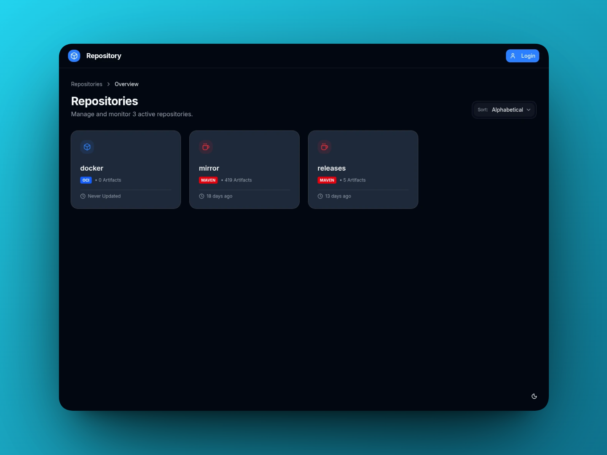

<h1 align="center">Arcae</h1>
<p align="center">A self-hosted software repository.</p>



### Quick links
- [Features](#features)
- [Requirements](#requirements)
- [Installation](#installation)
- [Screenshots](#screenshots)

## Features
- **Maven** repository support
- **Docker/OCI** repository support
- **Kubernetes gateway API** - Automatic HTTPRoute configuration support for OCI repositories
- **Open ID Connect** - Link external accounts for easy sign ins
- Cleanup policies
- Mirroring of remote repositories
- User permissions for repository access
- Access tokens for deploying and accessing artifacts

## Requirements
This section lists all requirements that need to be met in order to run the repository application itself.
Additional software (such as PostgreSQL, Elasticsearch and more) is required and will impose its own set of requirements that need to be met.

### Hardware
**Two CPU cores** and **150 MB of Memory** are recommended for small scale deployments.
For reference, the containers of the live deployment each consume around 58 MB to 101 MB of memory total.

> [!NOTE]
> The ``JAVA_OPTIONS`` environment variable is used to limit the heap size.
> A value of ``-Xmx100m`` will limit the heap to 100 MB. At least 30 to 60 MB of additional memory is recommended
> to avoid out-of-memory errors. This memory is needed to store the binary and additional data such as network buffers.

A fully self-hosted setup including PostgreSQl, Elasticsearch and Minio (S3) will require at least 1.5 GB of memory.
Most of this memory (over 1 GB) is used by Elasticsearch, in the future Elasticsearch may become optional.

### Software
- **Linux**<br>
  Tested on Debian 12 and 13
- **Docker or Kubernetes**<br>
  Kubernetes should be reasonably up to date in order for cloud-native features, such as service discovery and the Gateway API support, to work.
- **PostgreSQL**<br>
  Tested on version 16.3
- **Elasticsearch**<br>
  Version 8.13.4, this is a hard constraint due to the way that the Elasticsearch client and the native-image builds work.
  As such you will most likely need to self-host this. A basic instance will require at least 1 GB of memory. 
- **S3 compatible storage**<br>
  Must support multipart upload, multipart copy operations and ranged get operations.

## Installation
The following sections explain how to get started with installing the repository.
**Configuration** reference can be found [here](https://github.com/Bethibande/Arcae/wiki/Configuration).

### Docker
To get started using docker, download the example [docker-compose.yaml](docker-compose.yaml) and run
```shell
docker compose up -d
```
> [!NOTE]
> This docker compose file is only meant to serve as an example. It is not meant for production use.
> Credentials should be changed and stored securely, and readiness-probes are missing.

Wait for the repository to be ready (it may crash and restart a few times until elasticsearch and postgresql are online).
And then navigate to ``http://localhost:8080/setup`` to create your admin user.

### Kubernetes / Helm
To get started using Kubernetes, pull the chart. Please note that this chart does not contain any PostgreSQL, Elasticsearch or S3 deployments.
You can find the values.yaml file [here](/chart/arcae/values.yaml).
```shell
# Add the repository
helm repo add arcae https://helm.bethibande.com/repo/bethibande/arcae/

# Pull the chart
helm pull arcae/arcae --version 1.2.0
```

## Screenshots
| Dashboard                                             | Artifact browser                                                    |
|-------------------------------------------------------|---------------------------------------------------------------------|
|           |                |
| Version listing                                       | Repository settings                                                 |
|  |  |
| Access Tokens                                         | Jobs                                                                |
|    |                            |
