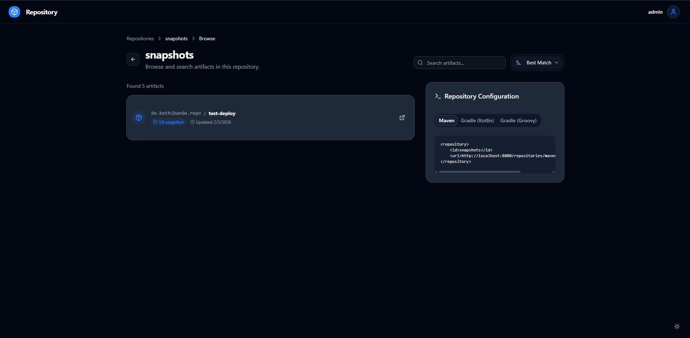
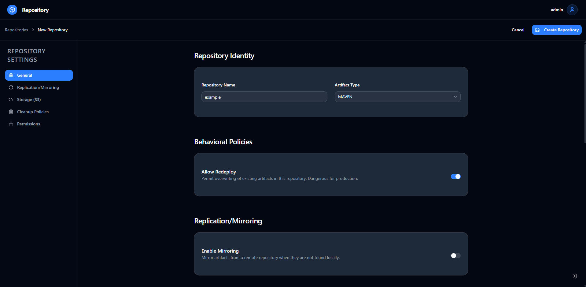
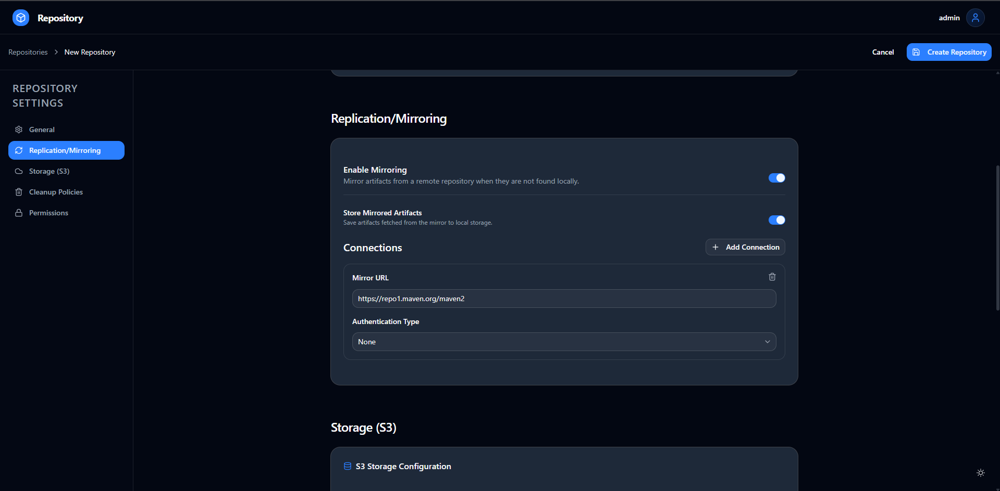
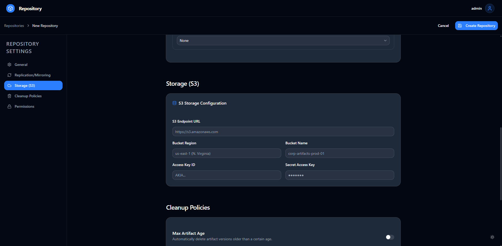
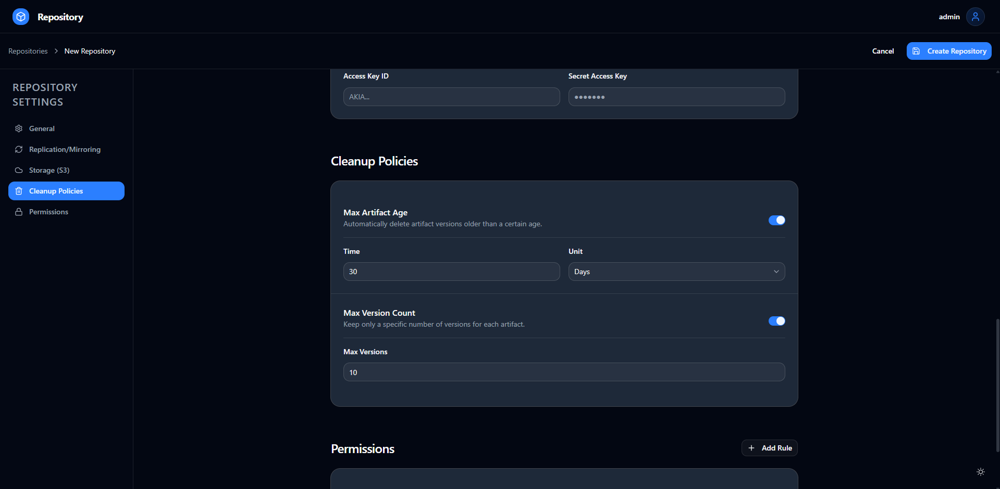
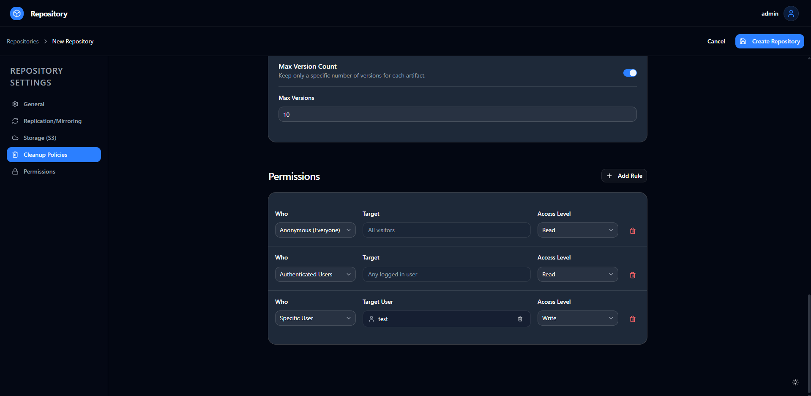

# Repository
This is my personal repository software.
For now only maven repositories are supported. Other repository types will be added in the future.

> [!NOTE]
> This project is in very early development, please use it with caution. Bugs should be expected.
> The performance is also quite lacking due to missing indexes and caching in most areas.
> And yes, most of the front-end is vibe-coded, deal with it. I'm a back-end developer. React makes me want to cry.

- [Features](#features)
- [Screenshots](#screenshots)
- [Installation](#install)

### Features
- Maven repository support
- Docker/OCI repository support
- Cleanup policies
- Mirroring of remote repositories
- User permissions for repository access
- Access tokens for deploying artifacts

### Screenshots
| Dashboard                                                             | Artifact browser                                                         |
|-----------------------------------------------------------------------|--------------------------------------------------------------------------|
|                           |                            |
| Version listing                                                       | Repository settings                                                      |
|                  |     |
| Repository mirror settings                                            | Repository s3 settings                                                   |
|   |  |
| Repository cleanup policies                                           | Repository permissions                                                   |
|  |     |

### Installation
To get started, download the example [docker-compose.yaml](docker-compose.yaml) and run
```shell
docker compose up -d
```
> [!NOTE]
> This docker compose file is only meant to serve as an example. It is not meant for production use.
> Credentials should be changed and stored securely, and readiness-probes are missing.

Wait for the repository to be ready (it may crash and restart a few times until elasticsearch and postgresql are online).
And then navigate to ``http://localhost:8080/setup`` to create your admin user.
