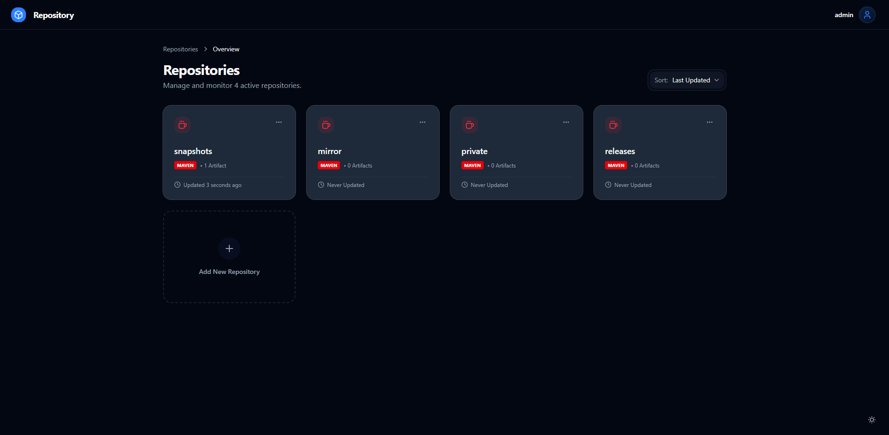
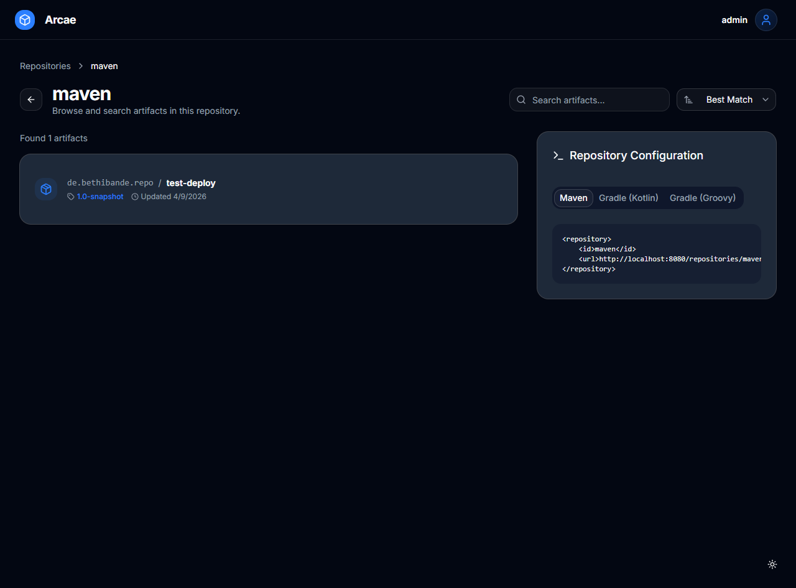
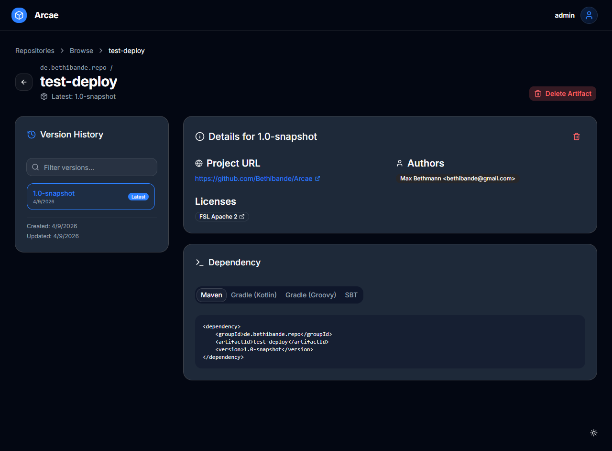
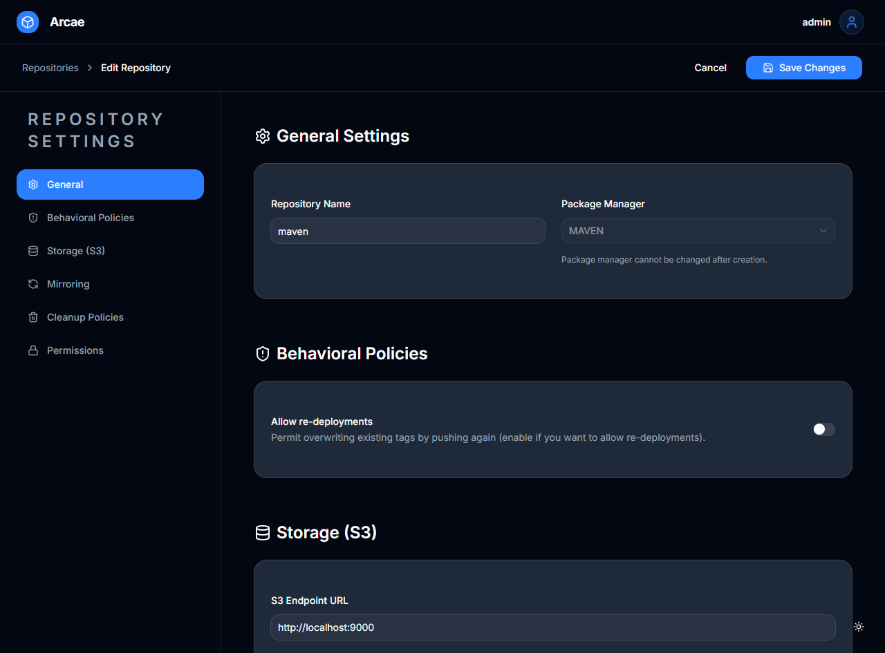
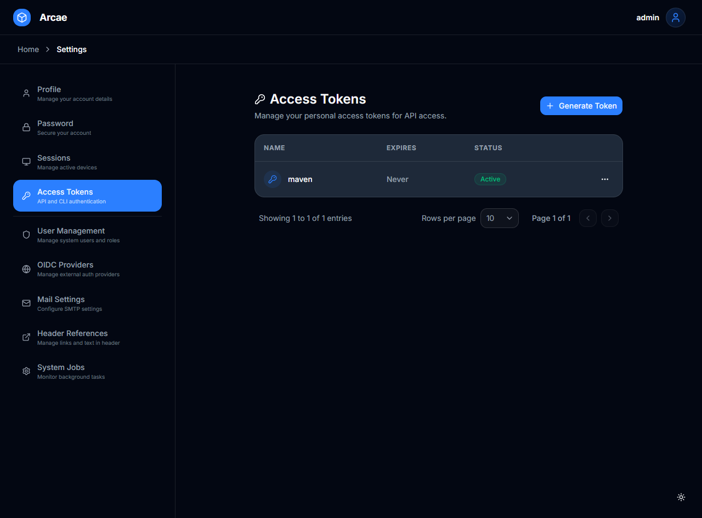
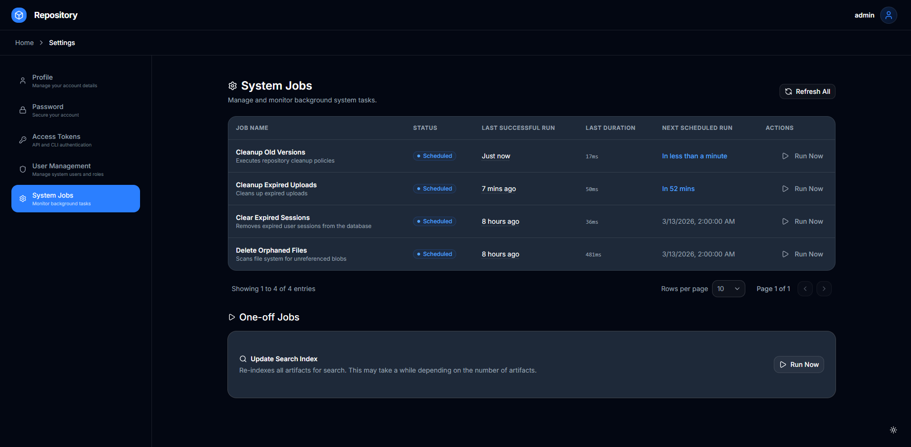

<h1 align="center">Repository</h1>
<p align="center">This is the source-code for my self-hosted maven/docker repository</p>


> [!WARNING]
> This project is in very early development, please use it with caution. Bugs should be expected.
> Performance is also still a work-in-progress.

### Quick links
- [Features](#features)
- [Installation](#installation)
- [Screenshots](#screenshots)

### Features
- **Maven** repository support
- **Docker/OCI** repository support
- **Kubernetes gateway API** - Automatic HTTPRoute configuration support for OCI repositories
- Cleanup policies
- Mirroring of remote repositories
- User permissions for repository access
- Access tokens for deploying and accessing artifacts

### Installation
To get started, download the example [docker-compose.yaml](docker-compose.yaml) and run
```shell
docker compose up -d
```
> [!NOTE]
> This docker compose file is only meant to serve as an example. It is not meant for production use.
> Credentials should be changed and stored securely, and readiness-probes are missing.

Wait for the repository to be ready (it may crash and restart a few times until elasticsearch and postgresql are online).
And then navigate to ``http://localhost:8080/setup`` to create your admin user.


### Screenshots
| Dashboard                                             | Artifact browser                                                    |
|-------------------------------------------------------|---------------------------------------------------------------------|
|           |                |
| Version listing                                       | Repository settings                                                 |
|  |  |
| Access Tokens                                         | Jobs                                                                |
|    |                            |